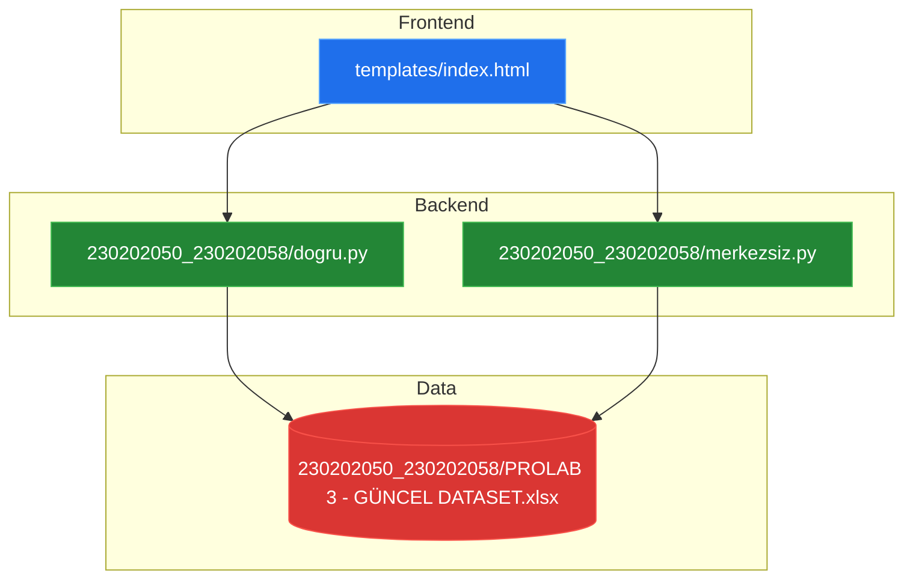
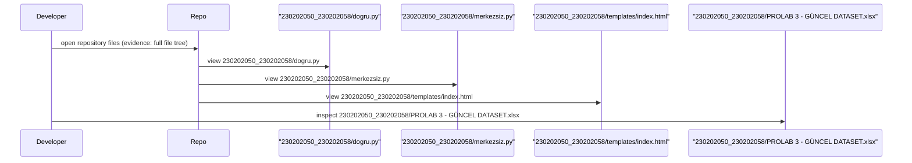

# System Blueprint: YusuffBulbul/Python-Makale-Yazar-liskisi-Graf

> Architecture and code review analysis
>
> Auto-generated on 2026-09-07 by Repo-to-Blueprint Architect

# English Version

## Project Purpose
This repository contains two Python scripts (230202050_230202058/dogru.py, 230202050_230202058/merkezsiz.py), an HTML template (230202050_230202058/templates/index.html), and an Excel dataset (230202050_230202058/PROLAB 3 - GÜNCEL DATASET.xlsx). No clear application entry-point or README explaining runtime behavior is present in the supplied files, so the project's executable purpose cannot be determined from the evidence.

## Technical Stack
- **Language**: Python (.py), HTML (.html), Excel (.xlsx)
- **Framework**: none detected (no dependency manifest files present)
- **Key Dependencies**: none declared (no requirements.txt, pyproject.toml, setup.py, Pipfile, or package.json found)
- **Infrastructure**: (none declared in repository files)

## Architecture Blueprint

## Request Flow

## Evidence-Based Risks
1. Presence of a binary dataset file in the repository: 230202050_230202058/PROLAB 3 - GÜNCEL DATASET.xlsx — increases repository size and may contain sensitive data (file present in the tree).
2. No declared dependency/packaging manifest: no requirements.txt, pyproject.toml, setup.py, Pipfile, or package.json found in the full file tree — leads to reproducibility and deployment ambiguity.
3. No clear runtime entry-point or app wiring (no app.py, main.py, index.js, or explicit README execution instructions); only standalone scripts exist: 230202050_230202058/dogru.py and 230202050_230202058/merkezsiz.py — impedes understanding how components integrate.

## Code Review

### Priority Summary
| ID | Priority | Category | Technical Debt | Evidence | Impact | Recommended Action |
|---|---:|---|---|---|---|---|
| SEC-01 | P1 | Security | Presence of dataset file in repo | 230202050_230202058/PROLAB 3 - GÜNCEL DATASET.xlsx (file present in tree) | Potential data exposure and repo bloat | Remove sensitive data from VCS, add to .gitignore, store dataset in external data store or provide a sanitized sample and usage instructions |
| STA-01 | P2 | Static Analysis | No tests or test harness detected | Full file tree contains no tests or test_*.py files (files: dogru.py, merkezsiz.py) | Reduced maintainability and confidence in correctness | Add unit/integration tests and CI test configuration; include example inputs/expected outputs |
| ARC-01 | P2 | Architecture | No defined application entry-point or wiring | Repository contains scripts (230202050_230202058/dogru.py, 230202050_230202058/merkezsiz.py) and template (templates/index.html) but no app.py/main.py/index.js or documentation linking them | Unclear runtime behavior and integration, harder onboarding | Define a clear entry-point (e.g., app.py) and document how scripts and templates interact; add README usage section |
| TEC-01 | P2 | Technology | Missing dependency manifest and reproducibility config | Full file tree shows no requirements.txt, pyproject.toml, setup.py, Pipfile, or package.json | Hard to reproduce environment, dependency drift risk | Add requirements.txt or pyproject.toml with pinned dependencies and provide a short setup/run guide in README |
| TEC-02 | P3 | Technology | Binary dataset stored in repository increases size | 230202050_230202058/PROLAB 3 - GÜNCEL DATASET.xlsx present in repo root | Larger repo clones; versioning binary diff inefficiency | Move dataset out of Git history (git rm --cached + add to .gitignore) and host externally; if retained, document rationale and versioning plan |

### Static Analysis
- P2 STA-01: No evidence of automated tests or test files (full file tree shows only dogru.py, merkezsiz.py, templates/index.html and an Excel file). Add tests and CI test steps.

### Security
- P1 SEC-01: Dataset file present in repository at 230202050_230202058/PROLAB 3 - GÜNCEL DATASET.xlsx. Consider removal from VCS and adding .gitignore; audit contents for sensitive data.

### Architecture
- P2 ARC-01: No explicit application entry-point or integration documentation. Evidence: absence of common entry files (app.py/main.py/index.js) and presence of standalone scripts and templates. Recommend defining application wiring and documenting runtime flow.

### Technology
- P2 TEC-01: No dependency manifest detected (no requirements.txt, pyproject.toml, setup.py, Pipfile, or package.json in the repository). Add one to capture dependencies and improve reproducibility.
- P3 TEC-02: Binary dataset file stored directly in repo (230202050_230202058/PROLAB 3 - GÜNCEL DATASET.xlsx) increases repository size and complicates diffs/versioning. Consider external hosting and history rewrite if removal is needed.

(End of English report)

---

## Repository Stats
| Metric | Value |
|---|---|
| Total Files | 5 |
| Total Directories | 2 |
| Generated | 2026-09-07 |
| Source | [YusuffBulbul/Python-Makale-Yazar-liskisi-Graf](https://github.com/YusuffBulbul/Python-Makale-Yazar-liskisi-Graf) |

---

*Repo-to-Blueprint Architect via n8n*
