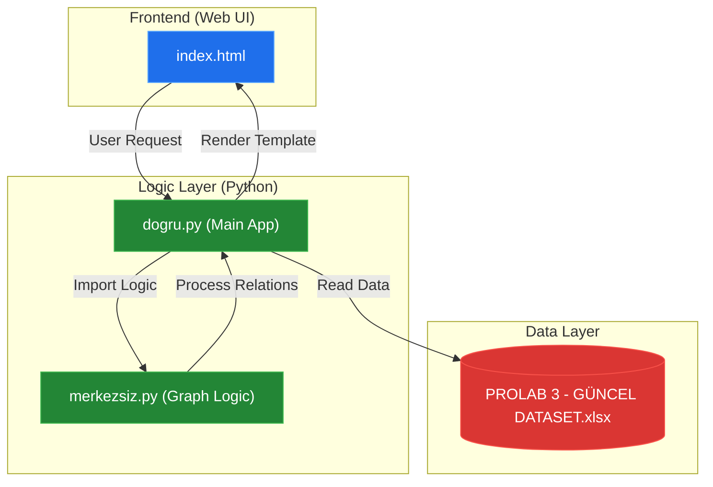
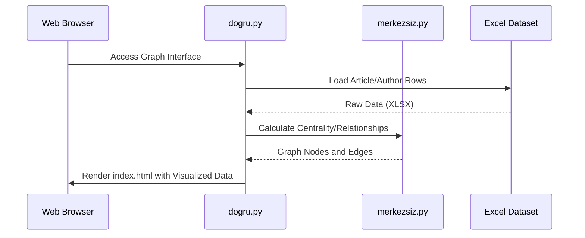

# System Blueprint: YusuffBulbul/Python-Makale-Yazar-liskisi-Graf

> Architecture analysis
>
> Auto-generated on 2026-09-07 by Repo-to-Blueprint Architect

# English Version

## Project Purpose
The project is a Python-based analytical tool designed to visualize and process relationships between academic articles and authors. It utilizes an Excel dataset (`PROLAB 3 - GÜNCEL DATASET.xlsx`) to generate graph-based representations of author collaborations, served through a web interface.

## Technical Stack
- **Language**: Python, HTML
- **Framework**: Flask (Inferred from `templates/` directory structure and `.py` entry points)
- **Key Dependencies**: None listed (Dependency files like `requirements.txt` or `pyproject.toml` are missing from the repository).
- **Infrastructure**: Local filesystem-based data storage (Excel).

## Architecture Blueprint

## Request Flow

## Evidence-Based Risks
1. **Dependency Management**: The repository lacks a `requirements.txt` or `environment.yml` file, making it difficult to identify specific versions of libraries (e.g., `pandas`, `networkx`, or `flask`) required to run the code.
2. **Data Coupling**: The application is tightly coupled to a specific Excel file (`PROLAB 3 - GÜNCEL DATASET.xlsx`). Any change in the spreadsheet schema or missing file will cause a runtime failure in `dogru.py`.
3. **Performance Scalability**: Processing graph relationships directly from an Excel file in a web request context (as suggested by the file structure) may lead to high latency and memory usage as the dataset grows.

---

## Repository Stats
| Metric | Value |
|---|---|
| Total Files | 4 |
| Total Directories | 2 |
| Generated | 2026-09-07 |
| Source | [YusuffBulbul/Python-Makale-Yazar-liskisi-Graf](https://github.com/YusuffBulbul/Python-Makale-Yazar-liskisi-Graf) |

---

*Repo-to-Blueprint Architect via n8n*
